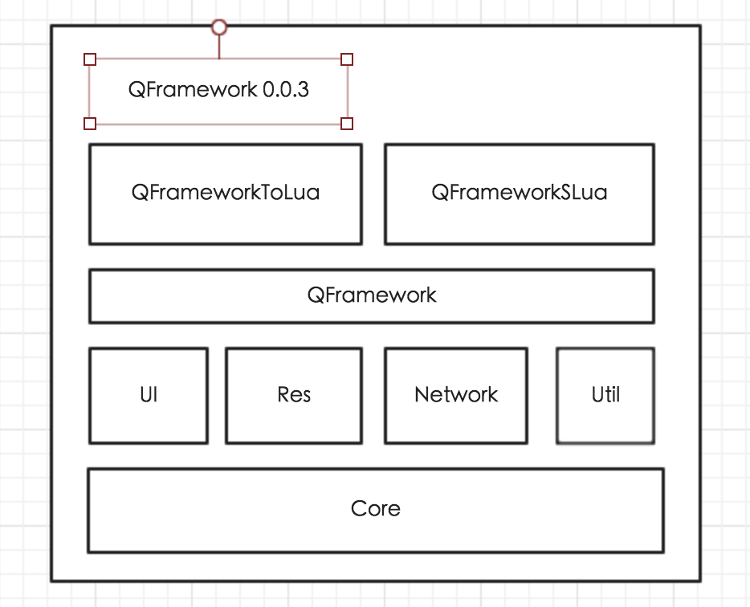

# QFramework




&emsp;&emsp;目前运行环境: Unity 5.4.2p1<br>

* 目前基本功能完成,正在调整组织架构<br>

​	目前这个框架只经历了一款游戏项目,所以很多地方做得不是很完善。以后还需要多做项目多打磨,就像自己的孩子一样,要慢慢养大。

如果大家想要打造自己的游戏框架的话可以在这个框架中找到借鉴,如果想商用这个框架的话,我会说坑会有很多,框架还不够健壮,存在很多设计问题,随着本人的能力提升,相信框架会越来越完善。

----------------

	
```
using UnityEngine;
using System.Collections;
using QFramework;
/*
 *  1.是游戏的入口
 *  2.不同功能模块的通信的中转站（当然用发消息的模式可能更好一些)
 *  3.处理游戏的一些挂起,进入后台等待特殊事件。
 *  4.一些资源的预加载,释放资源
 *  5.游戏的主线程 控制网络消息和逻辑消息的调用(只负责调用不负责处理,当然这种写法也不是很好)
 *  6.大模块跳转,HOME->GAME,GAME->HOME
 */

/// <summary>
/// 管理所有的控制器,资源的加载 场景的切换都在左立做
/// </summary>

public class GameManager : QSingleton<GameManager> {

	private GameManager() {}

	/// <summary>
	/// 初始化
	/// </summary>
	public IEnumerator Init()
	{
		// 加载配置表数据
		yield return TableManager.Instance ().Init();

		// 初始化内存数据,可更改的数据
		yield return DataManager.Instance ().Init ();

		// 音频资源加载
		yield return SoundManager.Instance().Init();

	}
		

	/// <summary>
	/// 启动游戏
	/// </summary>
	public IEnumerator Launch()
	{
		SceneManager.Instance().EnterHomeScene();
		yield return null;
	}		

	/// <summary>
	/// 退出游戏
	/// </summary>
	void OnApplicationQuit()
	{
		DataManager.Instance().Save (); // 数据加载
	}
}

```


框架主要分为三层

游戏层,游戏的逻辑等

管理层,调用底层

底层,对Api的一些封装

Unity Api